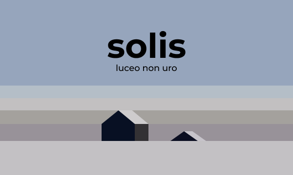

    

 
<h2>About solis</h2>

solis is a minimalist weather app that's as simple and easy-to-use as a toaster, but without the burnt toast. Built in Vanilla JS, it tells you the weather forecast in a jiffy without any frills and spills.

<h2>Usage</h2>

To get started, download the app or visit <a href="https://shuvam586.github.io/solis/" target="_blank">shuvam586.github.io/solis/</a>

<ul>
    <li><a href="./src/solis.apk" download>Android</a></li>
</ul>
